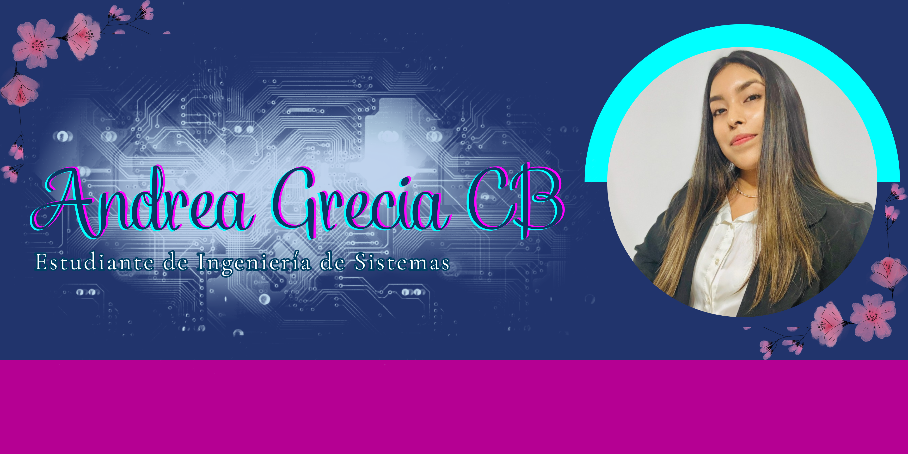

  

## 👩‍💻 Presentación

<table>
<tr>
<td width="65%">

<b>¿Quién soy?</b>  

Hola, soy <b>Andrea Grecia Castillo Breña</b>, de Lima, Perú. 
Soy estudiante de Ingeniería de Sistemas, actualmente cursando el <b>6.º ciclo</b> en la Universidad de Lima.  

Me apasiona la tecnología y programar soluciones funcionales y agradables. 
En mi tiempo libre disfruto ver series, películas y programar cosas random (y a veces chistosas 😄).

</td>

<td width="35%" align="center">
  
</td>
</tr>
</table>

## 💻 Lenguajes de Programación

## 🗄️ Bases de Datos

## 🔁 Control de Versiones

## 🚀 Proyectos

<table>
<tr>
<td width="50%">

### 🎬 Página de Streaming  
Proyecto académico grupal desarrollado con control de versiones en GitHub.

🔗 <a href="https://github.com/TonyHanx/PaginaStreamGrupo1" target="_blank">
Repositorio del proyecto
</a>

</td>
<td width="100%">

🛠️ Tecnologías:
- HTML, CSS, JavaScript  
- TypeScript  
- Git & GitHub  
- Trabajo colaborativo con branches

</td>
</tr>
</table>

## 🔗 Contactame ☕

<table>
<tr>

<!-- GIF -->
<td width="45%" align="left">
  
</td>

<!-- ICONOS -->
<td width="55%" align="left">

</td>
</tr>
</table>

